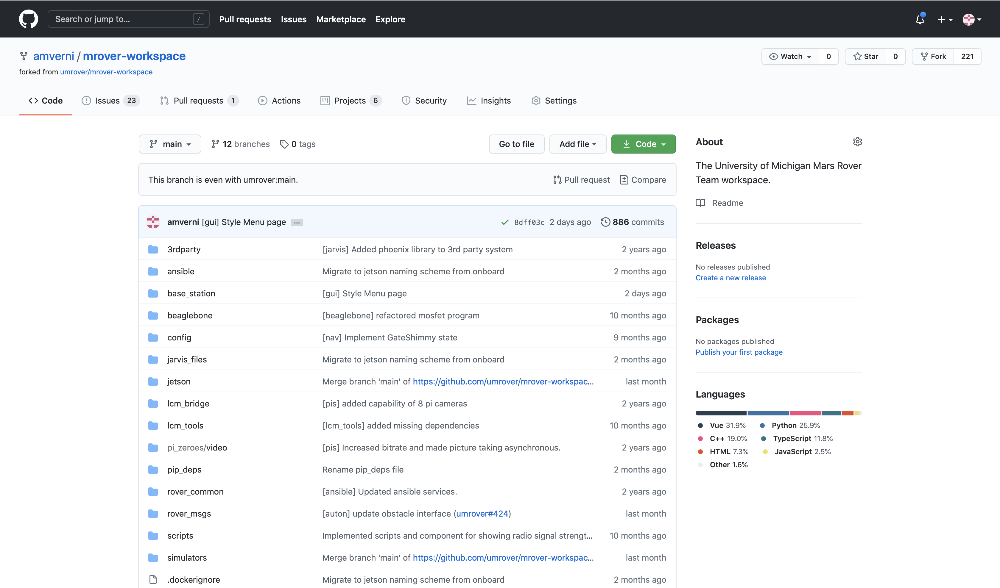
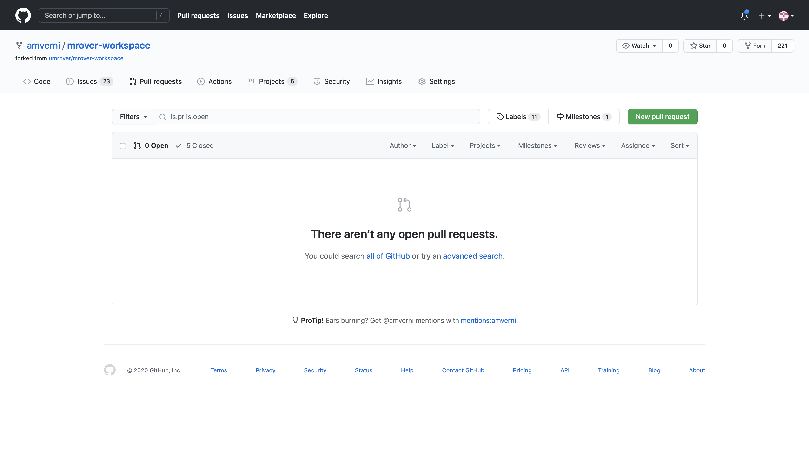
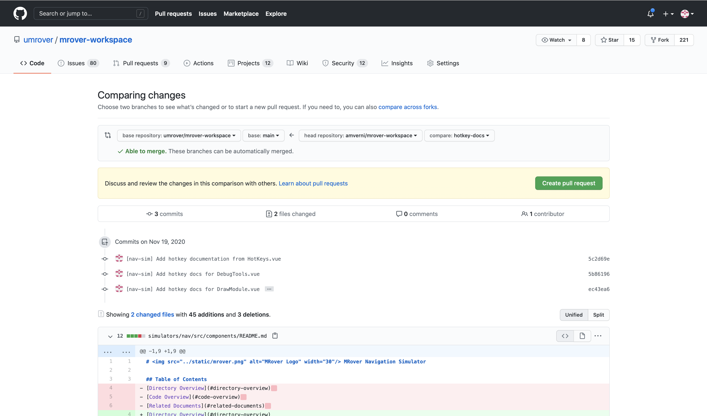
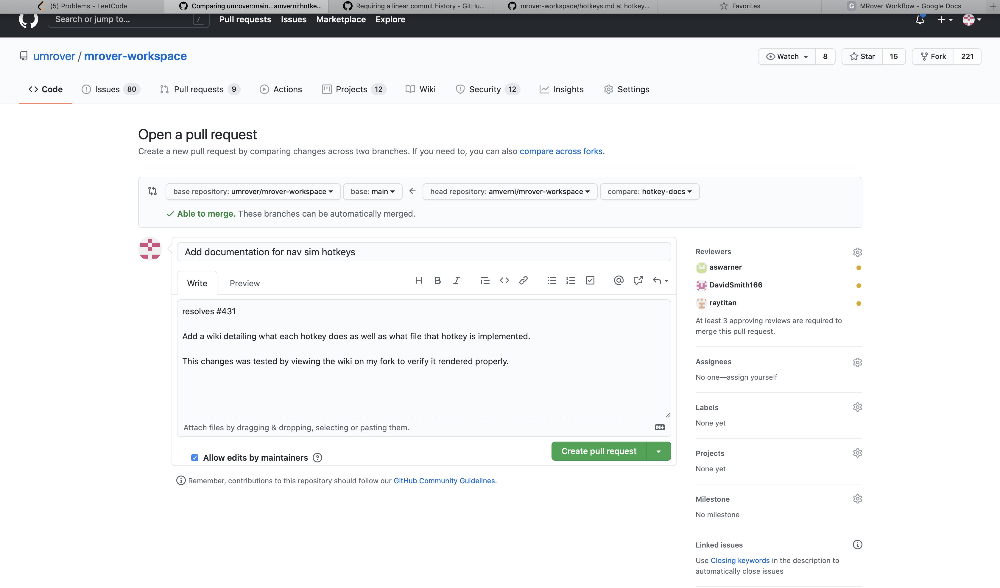
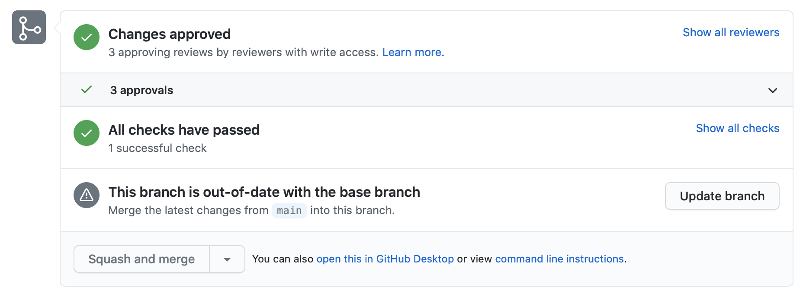
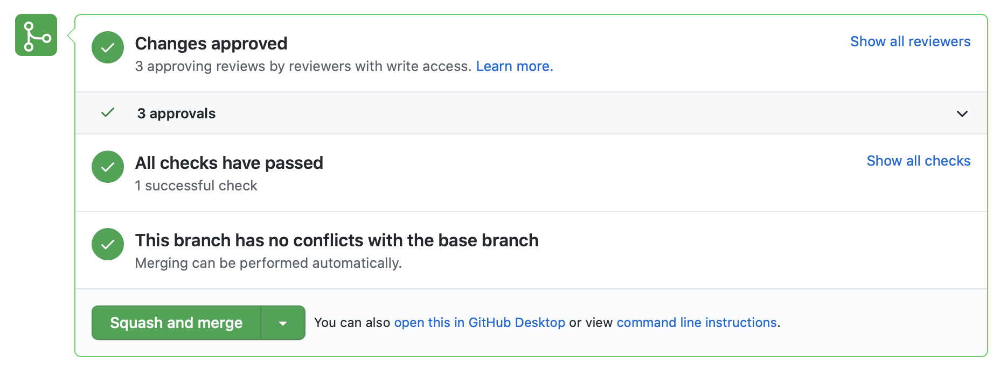
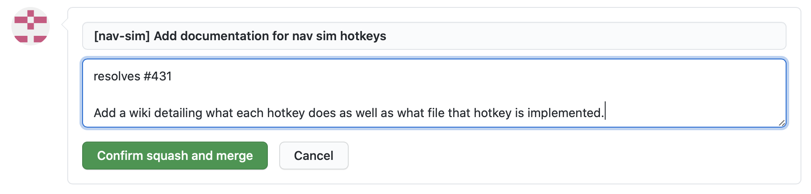
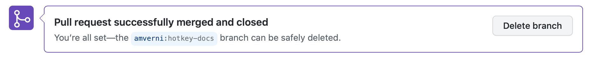

# MRover Workflow Wiki

## Table of Contents
- [MRover Workflow Wiki](#mrover-workflow-wiki)
  - [Table of Contents](#table-of-contents)
  - [Overview](#overview)
  - [Making Code Changes](#making-code-changes)
    - [Assumptions](#assumptions)
    - [Details](#details)
    - [Example](#example)
  - [Merging Code Changes into Main](#merging-code-changes-into-main)
    - [Assumptions](#assumptions-1)
    - [Details](#details-1)
    - [Example](#example-1)
  - [Appendix](#appendix)
    - [Appendix A: Anatomy of a MRover Formatted Commit Message](#appendix-a-anatomy-of-a-mrover-formatted-commit-message)
    - [Appendix B: MRover Required Reviewers Guidelines](#appendix-b-mrover-required-reviewers-guidelines)

## Overview
This document describes the process by which we recommend contributors should use when making code changes for our repo and how to go about getting those changes merged into our `main` branch.
This is not the only way to make or merge changes but, since many of our members are still learning Git, this process is standardized across the team and will allow you to spend less time dealing with nasty Git problems such as merge conflicts and how to avoid
unnecessarily huge review processes.
Additionally, using this workflow will help leads to help you use Git.
This document requires a working knowledge of Git. Please feel free to stop and look-up Git methods you don't fully understand as you come across them.

## Making Code Changes
This section describes the team's workflow from the point of getting assigned an issue to just before you make a pull request.

### Assumptions
We make the following assmptions in this tutorial.
If any of them are not true, please resolve this before proceeding.
1. You have set up your MRover enviromnent. This can be done by following along with our [Dev Environment Setup tutorial](https://docs.google.com/document/d/1l5zq6cyX115KAdGTMcv_rSFH0cFxCucFgVcFn7b-KnI/edit#heading=h.j1toowrjx1y4).
2. You have read and completed all the steps laid out in the [main README](/README.md).
3. Your `upstream` remote points to `https://github.com/umrover/mrover-workspace.git` or `git@github.com:umrover/mrover-workspace.git`. This can be checked with `git remote -v`.
4. Your `origin` remote points to `https://github.com/<your github username>/mrover-workspace.git` or `git@github.com:<your github username>/mrover-workspace.git`. This can be checked with `git remote -v`.

### Details
When making code changes, you should be working on one of our [issues](https://github.com/umrover/mrover-workspace/issues).
If you are working on multiple issues in parallel, make sure they are on separate branches (i.e. make sure you follow this process for each change independently).
This is so that they eventually end up in a single pull request.
In general, we try to do one issue per pull request.
This will also result in one single commit per issue because, upon merging, commits in a pull request will be squashed into one commit.

Making code changes can be broken down into 3 main steps.
The first step is the intial setup which only needs to be done once per issue.
The second step is making the actual changes to the code and testing along the way.
The third step is testing your changes in order to verify the correctness of your changes and to verify you did not break any other functionalities in the process of making your changes.
While the second step also involves testing, this testing is much more thorough in that it requires also doing integration testing of your changes with the rest of our codebase rather than just testing your code.

1. Create a new branch to work off of.
    * When we create a new branch, we want to make sure our new branch is branched off of the latest version of `upstream/main`.
      Thus, we first checkout `main`.
      ```console
      $ git checkout main
      ```
      Then we `pull` the latest changes.
      ```console
      $ git pull upstream main
      ```
      Now your local branch `main` is up to date with `upstream/main`.
    * Now create your new branch. By default it will be based off of the branch you currently have checked out (`main` in this case which is now the same as `upstream/main`).
      Name this new branch something related to the changes you're making.
      ```console
      $ git checkout -b <your branch name>
      ```

2. Make code changes.
    * Checkout the local branch related to this change.
      ```console
      $ git checkout <your branch name>
      ```
    * Make sure you are working off of the most up to date code in case something changes that affects my changes.
      ```console
      $ git pull upstream main
      ```
      This may create a merge commit (depending on what changes have been merged into main since you last pulled).
      If necessary, resolve any merge conflicts that Git finds and follow the steps Git lays out when it notifies you of the merge conflict.
      Go ahead and save the merge commit with the message auto generated by Git.
    * Implement your code changes.
    * Test your code changes.
    * Stage your changes.
      ```console
      $ git add <list of files/directories you changed>
      ```
    * Commit your changes with a useful commit message.
    * Use `git status` and `git log` often!
      ```console
      $ git status
      ```
      ```console
      $ git log
      ```
    * Push your changes to your remote repository.
      ```console
      $ git push origin <your branch name>
      ```
    * Repeat this step as many times as necessary until your have met all the requirements laid out in the description of the issue you are working on.

3. Testing code changes.
    * Perform full system testing and integration testing to verify your changes and verify no regression to other changes as a result of your changes.
      While in a perfect world, this would mean regression testing all code in our repo, we understand this is not feasible.
      Thus, instead, you should focus on testing that no interface with another team was broken.
      If you find any bugs related to your code, go back to step 2.
      If you find any bugs not related to your code, create an issue.
    * For details on how to do thorough testing on MRover, please see any software team lead or technical advisor.

### Example
For this demo, we will be resolving
[issue 431](https://github.com/umrover/mrover-workspace/issues/431). This
example workflow is assuming that you have done your previous workflow using
this method otherwise there might be a few extra steps (in which case you should
reach out to a lead or SAM for more help if needed). If you’re just starting
out, you should be fine to follow along.

This example is intended to demonstrate the process rather than being something
we expect you to recreate the changes. Our suggestion is to use this as a guide
when making changes of your own and for you to refer back to this throughout.
We expect that this guide will be more useful to you as you are making changes
and likely will be too dense to remember everything when you first read it.

1. Create a new branch to work off of.
    * First, I want to base my changes off of the most up to date `upstream/main` branch.
      To do so, I check out my `main` branch and then I pull from `upstream/main`.
      ```console
      $ git checkout main
      Switch to branch 'main'
      Your branch is up to date with 'upstream/main'.
      $ git pull upstream main
      From https://github.com/umrover/mrover-workspace
       * branch                      main     -> FETCH_HEAD
      Already up to date.
      ```
    * Next, I want to create a new branch to do my code changes on that is based off of `main`/`upstream/main` (they are the same right now).
      I will call my branch `hotkey-docs`.
      ```console
      $ git checkout -b hotkey-docs
      Switched to a new branch 'hotkey-docs'
      ```

2. Make code changes.
    * First work session
        * If not already on my new branch (`hotkey-docs`), I check it out.
          Note that this did nothing (and told me so) since I was already on `hotkey-docs`.
          ```console
          $ git checkout hotkey-docs
          Already on 'hotkey-docs'
          ```
        * Next, I make sure I am working off of the most up to date code.
          I do this with `git pull upstream main`. Note that most likely this will have no effect since I just created this branch off the most up to date version of `upstream/main`.
          ```console
          $ git pull upstream main
          From https://github.com/umrover/mrover-workspace
           * branch                      main     -> FETCH_HEAD
          Already up to date.
          ```
        * *Make the actual changes to code.*
        * *Test the code changes.*
        * Checking `git status` often is a great habit to have.
          This can be done by typing `git status`.
          ```console
          $ git status
          On branch hotkey-docs
          Untracked files:
            (use "git add <file>..." to include in what will be committed)
                  simulators/nav/src/components/hotkeys.md

          nothing added to commit but untracked files present (use "git add" to track)
          ```
        * Now I want to stage my changes for commit. I do this with `git add`.
          I notice from `git status` that all my changes are in
          `simulators/nav/src/components/hotkeys.md` so I can add that file by typing `git add simulators/nav/src/components/hotkeys.md`.
          Note that I could have used `git add .` but I did not because it’s a good habit to think about what we want to be staging rather than blindly staging all changes.
          Using `git diff` is also a good tool here to see what was changed about those files.
          This might allow me to see if I forgot to remove a debug print statement, for example.
          ```console
          $ git add simulators/nav/src/components/hotkeys.md
          $ git status
          On branch hotkey-docs
          Changes to be committed:
            (use "git restore --staged <file>..." to unstage)
                  new file:   simulators/nav/src/components/hotkeys.md

          ```
        * Next I commit my changes using `git commit`.
          I type `git commit` at the command line and then type my commit message in the text editor that automatically opens up. Note that I do not intend for this to be my final commit message but I do want it to be useful so I can determine what I did in this commit.
          ```console
          $ git commit
          [hotkey-docs 5c2d69ea] [nav-sim] Add hotkey documentation from HotKeys.vue
           1 file changed, 33 insertions(+)
           create mode 100644 simulators/nav/src/components/hotkeys.md
          $ git status
          On branch hotkey-docs
          nothing to commit, working tree clean
          ```
          My commit message:
          ```console
          1 [nav-sim] Add hotkey documentation from HotKeys.vue
          2 # Please enter the commit message for your changes. Lines starting
          3 # with '#' will be ignored, and an empty message aborts the commit.
          4 #
          5 # On branch hotkey-docs
          6 # Changes to be committed:
          7 #   new file: simulators/nav/src/components/hotkeys.md
          8 #
          ```
        * I can type `git log` to view the change in the commit history. This is
          one I like to do pretty often just like `git status`.
          ```console
          $ git log
          ```
          The git log:
          ```console
          commit 5c2d69ea285843cc770fe44d99b064a54739db74 (HEAD -> hotkey-docs)
          Author: Andrew Vernier <amverni@umich.edu>
          Date:   Thu Nov 19 10:39:58 2020 -0500

              [nav-sim] Add hotkey documentation from HotKeys.vue

          commit 8dff03c3c4000fda2f2d4b990cdf5de2f24e4419 (upstream/main, origin/main, main)
          ...
          ```
        * Lastly, I push my changes, so that I don’t lose any work if something were to happen to my local repository, using `git push origin hotkey-docs`.
          ```console
          $ git push origin hotkey-docs
          Enumerating objects: 12, done.
          Counting objects: 100% (12/12), done.
          Delta compression using up to 8 threads
          Compressing objects: 100% (7/7), done.
          Writing objects: 100% (7/7), 1.20 KiB | 1.20 MiB/s, done.
          Total 7 (delta 4), reused 0 (delta 0)
          remote: Resolving deltas: 100% (4/4), completed with 4 local objects.
          remote:
          remote: Create a pull request for 'hotkey-docs' on GitHub by visiting:
          remote:      http://github.com/amverni/mrover-workspace/pull/new/hotkey-docs
          remote:
          To github.com:amverni/mrover-workspace.git
           * [new branch]        hotkey-docs -> hotkey-docs
          ```

    * Second work session
        * If not already on my new branch (`hotkey-docs`), I check it out.
        * Next, I make sure I am working off of the most up to date version of `upstream/main`.
          I do this with `git pull upstream main`.
          For learning purposes, let's look at an example where I made a few code changes before `pull`ing and that there were changes to `upstream/main` as this is the trickiest sitation.
          This doesn't change anything about the steps we do, but we can see that these unstaged and uncommitted changes were "fast-forwarded" on top of the changes I am pulling.
          There were no merge conflicts I had to deal with in this scenario.
          ```console
          $ git pull upstream main
          From https://github.com/umrover/mrover-workspace
           * branch              main       -> FETCH_HEAD
          Updating eeb8bf1a..4f886320
          Fast-forward
           ansible/roles/jetson_networks/files/rover.network | 1 +
           1 file changed, 1 insertion(+)
          ```
        * *Make the actual changes to code.*
        * *Test the code changes.*
        * Again, I stage, commit, and push my changes. I see that all my changes are in `simulators/nav/src/components/` and there are no changes in that directory that I don't want so I can `add` that entire directory.
          ```console
          $ git status
          On branch hotkey-docs
          Changes not staged for commit:
            (use "git add <file>..." to update what will be committed)
            (use "git restore <file>..." to discard changes in working directory)
                  modified:   simulators/nav/src/components/README.md
                  modified:   simulators/nav/src/components/hotkeys.md

          no changes added to commit (use "git add" and/or "git commit -a")
          $ git add simulators/nav/src/components
          $ git commit
          [hokey-docs 5b861961] [nav-sim] Add hotkey docs for DebugTools.vue
           2 files changed, 10 insertions(+), 3 deletions(-)
          $ git status
          On branch hotkey-docs
          nothing to commit, working tree clean
          $ git push origin hotkey-docs
          Enumerating objects: 15, done.
          Counting objects: 100% (15/15), done.
          Delta compression using up to 8 threads
          Compressing objects: 100% (8/8), done.
          Writing objects: 100% (7/7), 896 bytes | 896.00 KiB/s, done.
          Total 8 (delta 6), reused 0 (delta 0)
          remote: Resolving deltas: 100% (6/6), completed with 6 local objects.
          To github.com:amverni/mrover-workspace.git
             5c2d69ea..5b861961  hotkey-docs -> hotkey-docs
          ```
          My commit message:
          ```console
          1 [nav-sim] Add hotkey docs for DebugTools.vue
          2 # Please enter the commit message for your changes. Lines starting
          3 # with '#' will be ignored, and an empty message aborts the commit.
          4 #
          5 # On branch hotkey-docs
          6 # Changes to be committed:
          7 #   modified:   simulators/nav/src/components/README.md
          8 #   modified:   simulators/nav/src/components/hotkeys.md
          9 #
          ```
        * Using `git log`, I now see my two commits based off of
          `upstream/main`.
          ```console
          commit 5b861961d9e46e71591856ff69b092a3964f8406 (HEAD -> hotkey-docs, origin/hotkey-docs)
          Author: Andrew Vernier <amverni@umich.edu>
          Date:   Thu Nov 19 15:22:14 2020 -0500

              [nav-sim] Add hotkey docs for DebugTools.vue

          commit 5c2d69ea285843cc770fe44d99b064a54739db74
          Author: Andrew Vernier <amverni@umich.edu>
          Date:   Thu Nov 19 10:39:58 2020 -0500

              [nav-sim] Add hotkey documentation from HotKeys.vue

          commit 8dff03c3c4000fda2f2d4b990cdf5de2f24e4419 (upstream/main, origin/main, main)
          ...
          ```

    * Third work session
        * Hopefully by now this is getting repetitive to you!
          This is what we want - a process that is easy to remember and do.
        * If not already on my new branch (`hotkey-docs`), I check it out.
        * Next, I make sure I am working off of the most up to date version of `upstream/main` using  `git pull upstream main`.
        * *Make the actual changes to code.*
        * *Test the code changes.*
        * Again, I stage, commit, and push my changes.
          ```console
          $ git status
          On branch hotkey-docs
          Changes not staged for commit:
            (use "git add <file>..." to update what will be committed)
            (use "git restore <file>..." to discard changes in working directory)
                  modified:   simulators/nav/src/components/hotkeys.md

          no changes added to commit (use "git add" and/or "git commit -a")
          $ git add simulators/nav/src/components/hotkeys.md
          $ git status
          On branch hotkey-docs
          Changes to be committed:
            (use "git restore --staged <file>..." to unstage)
                  modified:   simulators/nav/src/components/hotkeys.md

          $ git commit
          [hotkey-docs ec43ea6b] [nav-sim] Add hotkey docs for DrawModule.vue
           1 file changed, 3 insertions(+), deletion(-)
          $ git status
          On branch hotkey-docs
          nothing to commit, working tree clean
          $ git log
          $ git push origin hotkey-docs
          Enumerating objects: 13, done.
          Counting objects: 100% (13/13), done.
          Delta compression using up to 8 threads
          Compressing objects: 100% (7/7), done.
          Writing objects: 100% (7/7), 748 bytes | 749.00 KiB/s, done.
          Total 7 (delta 5), reused 0 (delta 0)
          remote: Resolving deltas: 100% (5/5), completed with 5 local objects.
          To github.com:amverni/mrover-workspace.git
             5b861961..ec43ea6b  hotkey-docs -> hotkey-docs
          ```
          My commit message:
          ```console
           1 [nav-sim] Add hotkey docs for DrawModule.vue
           2
           3 This change also fixes a todo with the naming of the LCM
           4 messages section
           5 # Please enter the commit message for your changes. Lines starting
           6 # with '#' will be ignored, and an empty message aborts the commit.
           7 #
           8 # On branch hotkey-docs
           9 # Changes to be committed:
          10 #   modified:   simulators/nav/src/components/hotkeys.md
          11 #
          ```
          The git log:
          ```console
          commit ec43ea6bdadef6a3d74715c4aae82785d1ffff15 (HEAD -> hotkey-docs, origin/hotkey-docs)
          Author: Andrew Vernier <amverni@umich.edu>
          Date:   Thu Nov 19 15:43:24 2020 -0500

              [nav-sim] Add hotkey docs for DrawModule.vue

              This change also fixes a todo with the naming of the LCM
              messages section

          commit 5b861961d9e46e71591856ff69b092a3964f8406
          Author: Andrew Vernier <amverni@umich.edu>
          Date:   Thu Nov 19 15:22:14 2020 -0500

              [nav-sim] Add hotkey docs for DebugTools.vue

          commit 5c2d69ea285843cc770fe44d99b064a54739db74
          Author: Andrew Vernier <amverni@umich.edu>
          Date:   Thu Nov 19 10:39:58 2020 -0500

              [nav-sim] Add hotkey documentation from HotKeys.vue

          commit 8dff03c3c4000fda2f2d4b990cdf5de2f24e4419 (upstream/main, origin/main, main)
          ...
          ```

    * Note that a work session does not need to be on different days or even at different times.
      It is a good habit to be committing often.
      In fact, I actually did all my "work sessions" on the same day without stopping between them.

3. Testing code changes.
    * I system and integration test my changes. If any bugs came up, I would
      repeat step 2 and add more commits onto `origin hotkey-docs`.
    * For my changes, this involves making sure the documentation renders
      correctly in various places, but for most changes this would involve more
      intensive testing such as onboard rover testing, simulator testing, etc.
      For details on how to test your specific code, see one of the team leads
      or SAMs.

## Merging Code Changes into Main
This section describes the team's workflow starting right after you have finished making your code change to merging that code into `upstream/main`.

### Assumptions
We make the following assumptions in this tutorial.
If any of them are not true, please resolve this before proceeding.
1. All [assumptions from Making Code Changes](#assumptions) apply to this section as well.
2. You have completed a code change via the guidelines laid out [previously](#making-code-changes).

### Details
In order to merge a code change into `upstream`, you need to create a pull request.
After creating a pull request, you need to pass the automated checks and get 3 review approvals.
In order to get 3 approvals, you will need to address others' review comments and, potentially, make edits to your code.
Once you have done this, you will be able to squash your code into a single final commit and merge in your code.

1. Create a pull request from `<your github username>/<your branch name>` to `umrover/main`.
    * Use the GitHub web page to create this pull request starting from your forked repository (`https://github.com/<your github username>/mrover-workspace`).
    * Navigate to the `pull requests` tab on your fork (`https://github.com/<your github username>/mrover-workspace/pulls`).
    * Then click `new pull request` (`https://github.com/<your github username>/mrover-workspace/compare`).
    * Verify/set the base and head repositories and branches.
      Then click `Create pull request`.
    * On the resulting page (`https://github.com/umrover/mrover-workspace/compare/main...<your github username>:<your branch name>`) modify the pull request title and comment and add your reviewers according to [Appendix B: MRover Required Reviewers Guidelines](#appendix-b-mrover-required-reviewers-guidelines).
      Your title should be in the following format.
      ```console
      [<team/project>] <commit summary>
      ```
      Your comment should have more details regarding your change and link to the issue being resolved.
      It should be in the following format.
      ```console
      <comma separated list of <keyword to link to issue> #<issue number>>

      <detailed commit message>

      <description of the testing that occured>
      ```
      You can notice that the pieces that make up the title and comment are the same pieces that make up a properly formatted final commit message.
      This is because these will eventually become the starting point for your final commit message so do your best to make these pieces something you can reuse later.
      However, don't worry about this _too much_ just yet because you will have the chance to change it.
      For more information on what each of the pieces used to create the final commit message are, see [Appendix A: Anatomy of a MRover Formatted Commit Message](#appendix-a-anatomy-of-a-mrover-formatted-commit-message).
    * Then click the `Create pull request` button which will take me to the page for the newly created pull request (`https://github.com/umrover/mrover-workspace/pull/<pull request number>`).

2. Address any review comments or build errors reported by Travis.
   * Respond to comments that require further discussion or to clarify someone's confusion.
     If you talk offline, put a quick summary of your conversation as the response so that others who refer back to the pull request page to get details on a specific change still can do so.
    * For comments that require code changes or automated check failures, make a code change in a similar manner as to how you did in the [Making Code Changes](#making-code-changes) section.
      When you push new commits to the same branch as before (`origin/<your branch name>`), the pull request will automatically update, dismiss old reviews, and rerun the automated checks.
    * Repeate this step until you have at least 3 approvals, 0 reviewers requesting changes, and passed the automated checks.

3. Merge code.
    * If your branch is out of date, click the `Update branch` button.
      This button will only appear if you are out of date.
      In other words, if this button appears, you must click it.
      You will not be allowed to merge your code without updating your branch.
    * Wait for the automated checks to run again.
      If they fail, you must go back to step 2.
      If they pass, you can click the `Squash and merge` button.
    * Modify the commit message to be your final commit message.
      This commit message must be in the format specified in [Appendix A: Anatomy of a MRover Formatted Commit Message](#appendix-a-anatomy-of-a-mrover-formatted-commit-message).
      You can hopefully reuse some of what you wrote in step 1.
      The summary will default to include the pull request number.
      You can leave this in the summary for future convenience.
    * Click the `Confirm squash and merge` button.
    * Delete the head branch by clicking the `Delete branch` button.

### Example
We will be continuing the demo of resolving [issue 431](https://github.com/umrover/mrover-workspace/issues/431).

1. Create a pull request from `amverni/hotkey-docs` to `umrover/main`.
    * I go to my [GitHub fork of mrover-workspace](https://github.com/amverni/mrover-workspace).
    * I click [`Pull requests`](https://github.com/umrover/mrover-workspace/pulls) at the top.
      <br/>
      
    * I click [`New pull request`](https://github.com/umrover/mrover-workspace/compare) on the right about one-third of the way down the screen.
      <br/>
      
    * I verify the base repository is `umrover/mrover-workspace`.
      I verify the base branch is `main`.
      I verify the head repository is `amverni/mrover-workspace`.
      I set the head branch to `hotkey-docs`.
      Then I click [`Create pull request`](https://github.com/umrover/mrover-workspace/compare/main...amverni:hotkey-docs) on the right about half-way down the screen.
      <br/>
      
    * I modify the pull request title and comment.
      This information will become my final commit message (however it can change later on).
      Note that I include a link to the issue being resolved (`#431`), a more detailed description, and a note on how this change was tested in the comment.
      I also add my reviewers.
    * Then I click [`Create pull request`](https://github.com/umrover/mrover-workspace/pull/505) just below the comment box.
      <br/>
      

2. Address any review comments or build errors reported by Travis.
    * Some comments only require me to respond to them in order to either further a conversation or clear up a confusion.
      I respond to these accordingly.
    * Some comments require code changes so I do another work session.
        * If not already on my new branch (`hotkey-docs`), I check it out.
        * Next, I make sure I am working off of the most up to date version of `upstream/main` using  `git pull upstream main`. I save the automated commit message to create the merge commit. This step is optional as I can use the `Update branch` button on the [pull request page](https://github.com/umrover/mrover-workspace/pull/505) (which only appears if it's applicable).
          ```console
          $ git pull upstream main
          From https://github.com/umrover/mrover-workspace
           * branch              main       -> FETCH_HEAD
          Removing none.jpg
          Removing jetson/cv/perception.hpp
          Removing jetson/cv/meson_option.txt
          ...
          ```
        * *Make the actual changes to code.*
        * *Test the code changes.*
        * I stage, commit, and push my changes.
          ```console
          $ git status
          On branch hotkey-docs
          Changes not staged for commit:
                (use "git add <file>..." to update what will be committed)
                (use "git restore <file>..." to discard changes in working directory)
                      modified:   simulators/nav/README.md
                      modified:   simulators/nav/src/README.md
                      modified:   simulators/nav/src/components/README.md
                      modified:   simulators/nav/src/components/hotkeys.md

          no changes added to commit (use "git add" and/or "git commit -a")
          $ git commit
          [hotkey-docs 04240fb8] Address @aswarner's comments
           4 files changed, 16 insertions(+), 16 deletions(-)
          $ git status
          On branch hotkey-docs
          Changes to be committed:
            (use "git restore --staged <file>..." to unstage)
                      modified:   simulators/nav/README.md
                      modified:   simulators/nav/src/README.md
                      modified:   simulators/nav/src/components/README.md
                      modified:   simulators/nav/src/components/hotkeys.md
          $ git log
          $ git push origin hotkey-docs
          Enumerating objects: 29, done.
          Counting objects: 100% (27/27), done.
          Delta compression using up to 8 threads
          Compressing objects: 100% (12/12), done.
          Writing objects: 100% (12/12), 1.26 KiB | 1.26 MiB/s, done.
          Total 12 (delta 9), reused 0 (delta 0)
          remote: Resolving deltas: 100% (9/9), completed with 8 local objects.
          To github.com:amverni/mrover-workspace.git
             ec43ea6b..04240fb8  hotkey-docs -> hotkey-docs
          ```
          My commit message:
          ```console
           1 Address @aswarner's comments
           2 # Please enter the commit message for your changes. Lines starting
           3 # with '#' will be ignored, and an empty message
           4 #
           5 # On branch hotkey-docs
           6 # Changes to be committed:
           7 #   modified:   simulators/nav/README.md
           8 #   modified:   simulators/nav/src/README.md
           9 #   modified:   simulators/nav/src/components/README.md
          10 #   modified:   simulators/nav/src/components/hotkeys.md
          11 #
          ```

          The git log:
          ```console
          commit 04240fb816aa1fc839f49c50c9b7060742281947 (HEAD -> hotkey-docs)
          Author: Andrew Vernier <amverni@umich.edu>
          Date:   Thu Nov 24 09:18:42 2020 -0500

              Address @aswarner's comments

          commit 0858f71ac7270e91d25f281a54c5cf5382e4a6f7
          Merge: ec43ea6b 4e18182bbd
          Author: Andrew Vernier <amverni@umich.edu>
          Date:   Thu Nov 24 09:13:28 2020 -0500

              Merge branch 'main' of https://github.com/umrover/mrover-workspace into hotkey-docs

          commit 4e182bbd62fe388a630a98a6b863ebdf260f8f29 (upstream/main)
          ...
          ```
    * I now get 3 approvals and pass the automated checks, so I move on to step 3.

3. Merge code.
    * My branch is out of date since other changes have been merged into main since I last merged with `upstream/main`.
      I click the `Update branch` button to resolve this.
      <br/>
      
    * Once the automated checks pass again, I can merge.
      I click the `Squash and merge` button.
      <br/>
      
    * I modify the commit message to match the format specified in this document.
      My final commit message is:
      ```
      [nav-sim] Add documentation for nav sim hotkeys

      resolves #431

      Add a wiki detailing what each hotkey does as well as what file that hotkey is implemented.

      This change was tested by viewing the wiki on my fork to verify it rendered properly.
      ```
    * Then I click the `Confirm squash and merge` button.
      <br/>
      
    * Lastly, I delete the branch that I was working off of by clicking the `Delete branch` button.
      <br/>
      

## Appendix

### Appendix A: Anatomy of a MRover Formatted Commit Message
This section details how to properly format a commit message in accordance with MRover guidelines and what each section of the commit message is.

A commit message should have the following format.
```console
[<team/project>] <commit summary>

<comma separated list of <keyword to link to issue> #<issue number>>

<detailed commit message>

<description of the testing that occured>
```

Below is a quick breakdown of each of the sections of a properly formatted commit message.
* _Team/project_: the team or project that the code being changed belongs to.
* _Commit summary_: a quick one line summary that describes the change.
* _Keyword to link to issue_: a keyword that can be used to link pull requests to issues. [Here](https://docs.github.com/en/free-pro-team@latest/github/managing-your-work-on-github/linking-a-pull-request-to-an-issue#linking-a-pull-request-to-an-issue-using-a-keyword) is a complete list of the possible keywords.
* _Issue number_: the id number associated with the issue being resolved by this commit.
* _Comma separated list of..._: A list of keywords and issue number pairs separated by a comma. In most cases, this is a list of length one as most pull requests will only address a single issue.
* _Detailed commit message_: More details describing what the pull request does. This will vary in length depending on the change.
* _Description of the testing that occured_: A description of what testing was done to verify the correctness of the change.

Here is a good example of a properly formatted commit message.
```console
[nav] Refactor navigation simulator

resolves umrover #308

Refactor navigation simulator to use Vue and TypeScript.
This refactor is indented to make the simulator easier to maintain,
make it easier to add new features, and move towards using
technologies that are more commonly used in industry.

We are keeping around the old version of the simulator
temporarily in case the refactored version has any major
problems. This should be deleted when the correctness of the
refactored version is confirmed.

This change was tested by verifying that the functionalities of the new simulator matched that of the old simulator.
Additionally, a linter was added to remove many potential bugs and any stylistic errors.
```

### Appendix B: MRover Required Reviewers Guidelines
This section details who needs to approve a pull request in order to merge it into `upstream/main`.

MRover requires 3 reviewers.
All reviewers should review the code and point out any stylistic and functional errors.
Stylistic errors are problems with the code that make it less readable than it could be otherwise.
If code is not readable, it is not maintainable.
We must keep in mind that we will all graduate within a few years of making contributions and thus others will have to read our code and make sense of it.
It is our responsiblity to make sure those future MRover developers can do this with as much ease as possible.
Functional errors are problems with the code that cause it to not run as expected and to not meet the guidelines set by the issue being resolved.

Each reviewer also has a unique role depending on who they are as described below.
1. The first reviewer is someone who is very familiar with the code being changed.
   It is this reviewer's responsibility to manually unit test the code to verify it's correctness.
   This person should also do a very thorough review of the code for stylistic and functional errors.
   Generally this can be a subteam lead, former lead, or experienced subteam member.
2. The second reviewer is someone who is very familiar with MRover testing proceedures.
   It is this reviewer's responsiblity to verify that the code being merged into main has been thoroughly tested both in terms of unit and integration testing.
   This person is generally an older member on the team such as a technical advisor or the branch lead.
3. The third reviewer is someone who is a younger member on the team who is still learning about the review process on MRover.
   It is this reviewer's responsibility to learn about our review process and see if there are ways we can improve our process in the future.

Reviewers should take as much pride in reviewing code as they do in writing code.
