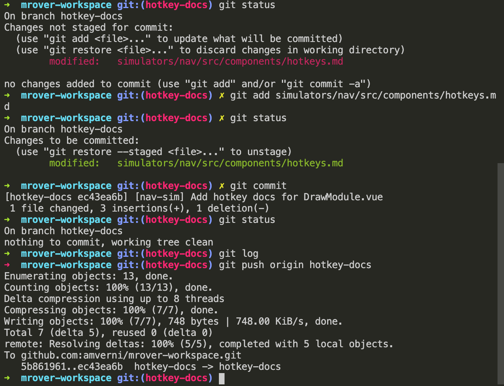
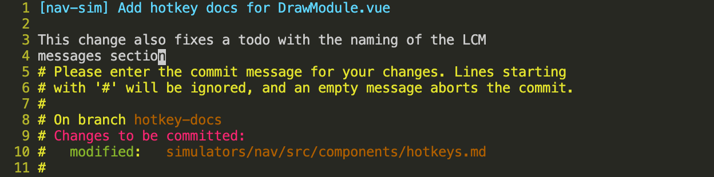
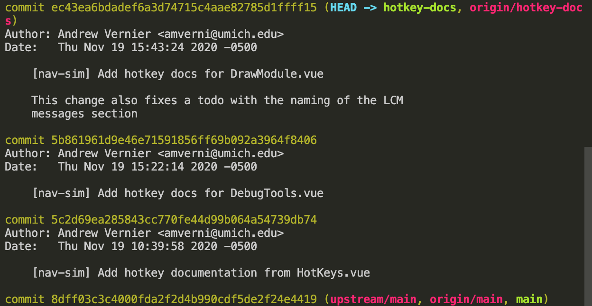

# MRover Workflow Wiki

## Table of Contents
- [MRover Workflow Wiki](#mrover-workflow-wiki)
  - [Table of Contents](#table-of-contents)
  - [Overview](#overview)
  - [Making Code Changes](#making-code-changes)
    - [Assumptions](#assumptions)
    - [Details](#details)
    - [Example](#example)
  - [Merging Code Changes into Main](#merging-code-changes-into-main)
    - [Assumptions](#assumptions-1)
    - [Details](#details-1)
    - [Example](#example-1)

## Overview
This document describes the process by which we recommend contributors should use when making code changes for our repo and how to go about getting those changes merged into our `main` branch.
This is not the only way to make or merge changes but, since many of our members are still learning Git, this process is standardized across the team and will allow you to spend less time dealing with nasty Git problems such as merge conflicts and how to avoid
unnecessarily huge review processes.
Additionally, using this workflow will help leads to help you use Git.
This document requires a working knowledge of Git. Please feel free to stop and look-up Git methods you don't fully understand as you come across them.

## Making Code Changes
This section describes the team's workflow from the point of getting assigned
an issue to just before you make a pull request.

### Assumptions
We make the following assmptions in this tutorial.
If any of there are not true, please resolve this before proceeding.
1. You have set up your MRover enviromnent. This can be done by following along with our [Dev Environment Setup tutorial](https://docs.google.com/document/d/1l5zq6cyX115KAdGTMcv_rSFH0cFxCucFgVcFn7b-KnI/edit#heading=h.j1toowrjx1y4).
2. You have read and completed all the steps laid out in the [main README](/README.md).
3. Your `upstream` remote points to `https://github.com/umrover/mrover-workspace.git` or `git@github.com:umrover/mrover-workspace.git`. This can be checked with `git remote -v`.
4. Your `origin` remote points to `https://github.com/<your-github-username>/mrover-workspace.git` or `git@github.com:<your-github-username>/mrover-workspace.git`. This can be checked with `git remote -v`.

### Details
When making code changes, you should be working on one of our [issues](https://github.com/umrover/mrover-workspace/issues).
If you are working on multiple issues in parallel, make sure they are on separate branches (i.e. make sure you follow this process for each change independently).
This is so that they eventually end up in a single pull request.
In general, we try to do one issue per pull request.
This will also result in one single commit per issue because, upon merging, commits in a pull request will be squashed into one commit.

Making code changes can be broken down into 3 main steps.
The first step is the intial setup which only needs to be done once per issue.
The second step is making the actual changes to the code and testing along the way.
The third step is testing your changes in order to verify the correctness of your changes and to verify you did not break any other functionalities in the process of making your changes.
While the second step also involves testing, this testing is much more thorough in that it requires also doing integration testing of your changes with the rest of our codebase rather than just testing your code.

1. Create a new branch to work off of.
    * When we create a new branch, we want to make sure our new branch is branched off of the latest version of `upstream/main`.
      Thus, we first checkout `main`.
      ```console
      $ git checkout main
      ```
      Then we `pull` the latest changes.
      ```console
      $ git pull upstream main
      ```
      Now your local branch `main` is up to date with `upstream/main`.
    * Now create your new branch. By default it will be based off of the branch you currently have checked out (`main` in this case which is now the same as `upstream/main`).
      Name this new branch something related to the changes you're making.
      ```console
      $ git checkout -b <your branch name>
      ```

2. Make code changes.
    * Checkout the local branch related to this change.
      ```console
      $ git checkout <your branch name>
      ```
    * Make sure you are working off of the most up to date code in case something changes that affects my changes.
      ```console
      $ git pull --rebase upstream main
      ```
    * Implement your code changes.
    * Test your code changes.
    * Stage your changes.
      ```console
      $ git add <list of files/directories you changed>
      ```
    * Commit your changes with a useful commit message.
      For the first commit you make, you should format your commit message in the following way:
      ```console
      [team/project] commit summary

      PR_link_keyword #issue_number

      Detailed commit message
      ```

      Here is a good example:
      ```console
      [nav] Refactor navigation simulator

      resolves umrover #308

      Refactor navigation simulator to use Vue and TypeScript.
      This refactor is indented to make the simulator easier to maintain,
      make it easier to add new features, and move towards using
      technologies that are more commonly used in industry.

      We are keeping around the old version of the simulator
      temporarily in case the refactored version has any major
      problems. This should be deleted when the correctness of the
      refactored version is confirmed.
      ```
      Don't worry about this _too much_ because you will have the chance to change later.
    * Use `git status` and `git log` often!
      ```console
      $ git status
      ```
      ```console
      $ git log
      ```
    * Push your changes to your remote repository.
      ```console
      $ git push origin <your branch name>
      ```
    * Repeat this step as many times as necessary until your have met all the requirements laid out in the description of the issue you are working on.

3. Testing code changes.
    * Perform full system testing and integration testing to verify your changes and verify no regression to other changes as a result of your changes.
      If you find any bugs related to your code, go back to step 2.
      If you find any bugs not related to your code, create an issue.
    * For details on how to do thorough testing on MRover, please see any software team lead or technical advisor.

### Example
For this demo, we will be resolving
[issue 431](https://github.com/umrover/mrover-workspace/issues/431). This
example workflow is assuming that you have done your previous workflow using
this method otherwise there might be a few extra steps (in which case you should
reach out to a lead or SAM for more help if needed). If you’re just starting
out, you should be fine to follow along.

This example is intended to demonstrate the process rather than being something
we expect you to recreate the changes. Our suggestion is to use this as a guide
when making changes of your own and for you to refer back to this throughout.
We expect that this guide will be more useful to you as you are making changes
and likely will be too dense to remember everything when you first read it.

1. Create a new branch to work off of.
    * First, I want to base my changes off of the most up to date `upstream/main` branch.
      To do so, I check out my `main` branch and then I pull from `upstream/main`.
      ```console
      $ git checkout main
      Switch to branch 'main'
      Your branch is up to date with 'upstream/main'.
      $ git pull upstream main
      From https://github.com/umrover/mrover-workspace
       * branch                      main     -> FETCH_HEAD
      Already up to date.
      ```
    * Next, I want to create a new branch to do my code changes on that is based off of `main`/`upstream/main` (they are the same right now).
      I will call my branch `hotkey-docs`.
      ```console
      $ git checkout -b hotkey-docs
      Switched to a new branch 'hotkey-docs'
      ```

2. Make code changes.
    * First work session
        * If not already on my new branch (`hotkey-docs`), I check it out.
          Note that this did nothing (and told me so) since I was already on `hotkey-docs`.
          ```console
          $ git checkout hotkey-docs
          Already on 'hotkey-docs'
          ```
        * Next, I make sure I am working off of the most up to date code.
          I do this with `git pull --rebase upstream main`. Note that most likely this will have no effect since I just created this branch off the most up to date version of `upstream/main`.
          ```console
          $ git pull --rebase upstream main
          From https://github.com/umrover/mrover-workspace
           * branch                      main     -> FETCH_HEAD
          Already up to date.
          Current branch hotkey-docs is up to date.
          ```
        * *Make the actual changes to code.*
        * *Test the code changes.*
        * Checking `git status` often is a great habit to have.
          This can be done by typing `git status`.
          ```console
          $ git status
          On branch hotkey-docs
          Untracked files:
            (use "git add <file>..." to include in what will be committed)
                  simulators/nav/src/components/hotkeys.md

          nothing added to commit but untracked files present (use "git add" to track)
          ```
        * Now I want to stage my changes for commit. I do this with `git add`.
          I notice from `git status` that all my changes are in
          `simulators/nav/src/components/hotkeys.md` so I can add that file by typing `git add simulators/nav/src/components/hotkeys.md`.
          Note that I could have used `git add .` but I did not because it’s a good habit to think about what we want to be staging rather than blindly staging all changes.
          Using `git diff` is also a good tool here to see what was changed about those files.
          This might allow me to see if I forgot to remove a debug print statement, for example.
          ```console
          $ git add simulators/nav/src/components/hotkeys.md
          $ git status
          On branch hotkey-docs
          Changes to be committed:
            (use "git restore --staged <file>..." to unstage)

          ```
        * Next I commit my changes using `git commit`.
          I type `git commit` at the command line and then type my commit message in the text editor that automatically opens up. Note that I do not intend for this to be my final commit message but I do want it to be useful so I can determine what I did in this commit. I plan to update the final commit message later.
          ```console
          1 [nav-sim] Add hotkey documentation from HotKeys.vue
          2 # Please enter the commit message for your changes. Lines starting
          3 # with '#' will be ignored, and an empty message aborts the commit.
          4 #
          5 # On branch hotkey-docs
          6 # Changes to be committed:
          7 #   new file: simulators/nav/src/components/hotkeys.md
          8 #
          ```
          ```console
          $ git commit
          [hotkey-docs 5c2d69ea] [nav-sim] Add hotkey documentation from HotKeys.vue
           1 file changed, 33 insertions(+)
           create mode 100644 simulators/nav/src/components/hotkeys.md
          $ git status
          On branch hotkey-docs
          nothing to commit, working tree clean
          ```
        * I can type `git log` to view the change in the commit history. This is
          one I like to do pretty often just like `git status`.
          ```console
          $ git log
          ```
          ```console
          commit 5c2d69ea285843cc770fe44d99b064a54739db74 (HEAD -> hotkey-docs)
          Author: Andrew Vernier <amverni@umich.edu>
          Date:   Thu Nov 19 10:39:58 2020 -0500

              [nav-sim] Add hotkey documentation from HotKeys.vue

          commit 8dff03c3c4000fda2f2d4b990cdf5de2f24e4419 (upstream/main, origin/main, main)
          ...
          ```
        * Lastly, I push my changes, so that I don’t lose any work if something were to happen to my local repository, using `git push origin hotkey-docs`.
          ```console
          $ git push origin hotkey-docs
          Enumerating objects: 12, done.
          Counting objects: 100% (12/12), done.
          Delta compression using up to 8 threads
          Compressing objects: 100% (7/7), done.
          Writing objects: 100% (7/7), 1.20 KiB | 1.20 MiB/s, done.
          Total 7 (delta 4), reused 0 (delta 0)
          remote: Resolving deltas: 100% (4/4), completed with 4 local objects.
          remote:
          remote: Create a pull request for 'hotkey-docs' on GitHub by visiting:
          remote:      http://github.com/amverni/mrover-workspace/pull/new/hotkey-docs
          remote:
          To github.com:amverni/mrover-workspace.git
           * [new branch]        hotkey-docs -> hotkey-docs
          ```

    * Second work session
        * If not already on my new branch (`hotkey-docs`), I check it out.
        * Next, I make sure I am working off of the most up to date version of `upstream/main`.
          I do this with `git pull --rebase upstream main`.
          Note that most likely this will have no effect since I just created this branch off the most up to date version of `upstream/main`.
          However, let's say I made a few code changes before `pull`ing.
          In this case, I could `stash` them, then `pull --rebase`, and then, if this changes are for [issue 431](https://github.com/umrover/mrover-workspace/issues/431), I un`stash` (`stash pop`) them.
          As the error message states, I could also commit them if I wanted.
          ```console
          $ git pull --rebase upstream main
          error: cannot pull with rebase: You have unstaged changes.
          error: please commit or stash them.
          $ git stash
          Saved working directory and index state WIP on hotkey-docs: 5c2d69ea [nav-sim] Add hokey documentation from HotKeys.vue
          $ git pull --rebase upstream main
          From https://github.com/umrover/mrover-workspace
           * branch              main       -> FETCH_HEAD
          Current branch hotkey-docs is up to date.
          $ git stash pop
          On branch hotkey-docs
          Changes not staged for commit:
            (use "git add <file>..." to update what will be committed)
            (use "git restore <file>..." to discard changes in working directory)
                  modified:   simulators/nav/src/components/hotkeys.md

          no changes added to commit (use "git add" and/or "git commit -a")
          Dropped refs/stash@{0} (8fb86b7414f1fa99b9beba00ffb5869627945195)
          ```
        * *Make the actual changes to code.*
        * *Test the code changes.*
        * Again, I stage, commit, and push my changes. I see that all my changes are in `simulators/nav/src/components/` and there are no changes in that directory that I don't want so I can `add` that entire directory.
          ```console
          $ git status
          On branch hotkey-docs
          Changes not staged for commit:
            (use "git add <file>..." to update what will be committed)
            (use "git restore <file>..." to discard changes in working directory)
                  modified:   simulators/nav/src/components/README.md
                  modified:   simulators/nav/src/components/hotkeys.md

          no changes added to commit (use "git add" and/or "git commit -a")
          $ git add simulators/nav/src/components
          $ git commit
          [hokey-docs 5b861961] [nav-sim] Add hotkey docs for DebugTools.vue
           2 files changed, 10 insertions(+), 3 deletions(-)
          $ git status
          On branch hotkey-docs
          nothing to commit, working tree clean
          $ git push origin hotkey-docs
          Enumerating objects: 15, done.
          Counting objects: 100% (15/15), done.
          Delta compression using up to 8 threads
          Compressing objects: 100% (8/8), done.
          Writing objects: 100% (7/7), 896 bytes | 896.00 KiB/s, done.
          Total 8 (delta 6), reused 0 (delta 0)
          remote: Resolving deltas: 100% (6/6), completed with 6 local objects.
          To github.com:amverni/mrover-workspace.git
             5c2d69ea..5b861961  hotkey-docs -> hotkey-docs
          ```
          ```console
          1 [nav-sim] Add hotkey docs for DebugTools.vue
          2 # Please enter the commit message for your changes. Lines starting
          3 # with '#' will be ignored, and an empty message aborts the commit.
          4 #
          5 # On branch hotkey-docs
          6 # Changes to be committed:
          7 #   modified:   simulators/nav/src/components/README.md
          8 #   modified:   simulators/nav/src/components/hotkeys.md
          9 #
          ```
        * Using `git log`, I now see my two commits based off of
          `upstream/main`.
          ```console
          commit 5b861961d9e46e71591856ff69b092a3964f8406 (HEAD -> hotkey-docs, origin/hotkey-docs)
          Author: Andrew Vernier <amverni@umich.edu>
          Date:   Thu Nov 19 15:22:14 2020 -0500

              [nav-sim] Add hotkey docs for DebugTools.vue

          commit 5c2d69ea285843cc770fe44d99b064a54739db74
          Author: Andrew Vernier <amverni@umich.edu>
          Date:   Thu Nov 19 10:39:58 2020 -0500

              [nav-sim] Add hotkey documentation from HotKeys.vue

          commit 8dff03c3c4000fda2f2d4b990cdf5de2f24e4419 (upstream/main, origin/main, main)
          ```

    * Third work session
        * Hopefully by now this is getting repetitive to you!
          This is what we want - a process that is easy to remember and do.
        * If not already on my new branch (`hotkey-docs`), I check it out.
        * Next, I make sure I am working off of the most up to date version of
          `upstream/main` using  `git pull --rebase upstream main`.
        * *Make the actual changes to code.*
        * *Test the code changes.*
        * Again, I stage, commit, and push my changes.
          <br/>
          
          <br/>
          
          <br/>
          

    * Note that a work session does not need to be on different days or even at
      different times. It is a good habit to be committing often.
      In fact, I actually did all my "work sessions" on the same day without
      stopping between them.

3. Testing code changes.
    * I system and integration test my changes. If any bugs came up, I would
      repeat step 2 and add more commits onto `origin hotkey-docs`.
    * For my changes, this involves making sure the documentation renders
      correctly in various places, but for most changes this would involve more
      intensive testing such as onboard rover testing, simulator testing, etc.
      For details on how to test your specific code, see one of the team leads
      or SAMs.

## Merging Code Changes into Main

### Assumptions

### Details

### Example
