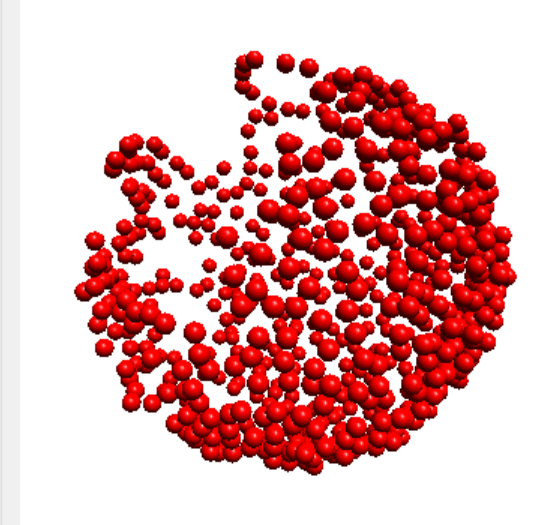

Code for measuring pitch, roll and yaw through the ICM 20948(IMU)
 ---
### About

The IMU is intended to read out accelerometer, gyroscope and magnetometer readings and translate them into pitch, roll, yaw and bearing for use in Auton's systems. The IMU must be calibrated whenever it is being used in a new environment. We do so by running the calibration script, and the Motion Sensor Calibrated Tool. This is followed by the main driver which utilizes the calibrated values in order to produce accurate data.

### LCM Channels Publishing/Subscribed To
**IMU Data**[publisher] \
Messages:  [IMUData.lcm](https://github.com/jjtom34/mrover-workspace/blob/master/rover_msgs/IMUData.lcm) "/imu_data" \
Publishers: beaglebone/imu \
Subscribers: onboard/filter, onboard/sensor_logging

### Usage
#### Require Electronic Components:
- 1 ICM 20948 Sensor
- 1 Beaglebone Black board or similar board
- 1 ArduinoUNO if calibrating
- At least 4 male-female jumper wires for connecting the sensor to the Beaglebone Black

#### Wiring
When wiring, only the set of pins related to i2c should be used. The top left corner should indicate the correct side and the pins right below it should be used.
[https://cdn.sparkfun.com/r/600-600/assets/learn_tutorials/8/9/3/15335-GPIO_I2C.jpg](https://cdn.sparkfun.com/r/600-600/assets/learn_tutorials/8/9/3/15335-GPIO_I2C.jpg)
VIN,GND and DA, CL should be wired to your power, ground, SDA, and SCL respectively but AD0 and NC should not be connected to anything.

#### Magnetometer Calibration 
Before running the IMU in a new environment, its magnetometer offset and softiron matrix values must be recalibrated. To do this the Motion Sensor Calibration Tool must be installed on the machine running the calibration script. The tool can be downloaded [here](https://www.pjrc.com/store/prop_shield.html). \
Make sure you have the arduino IDE downloaded as well. This can be downloaded [here](https://www.arduino.cc/en/main/software).  \
Open up calibration.ino in the arduino IDE. Make sure that the correct board is selected in the `tools\board` menu and that the `tools\port` selected is COMX (with X being an integer). \
Upload the script to the arduino by pressing the upload button. Open up the serial monitor with a baudrate of 115200 selected to check that data is being printed. If not, recheck your wires. \
Close the serial monitor. Open up the Motion Sensor Calibration Tool and change the port to COMX. A red dot should appear in the tool. Begin to move the IMU in a figure 8 motion. As you move the IMU around more read dots will start showing up. Continue this motion in different directions until the tool shows a sphere of red dots that looks similar to the one in this image. \
 \
Copy the values displayed in the right column of the tool into the `calibration.txt` file that can be found in the src file. \
The Magnetic Offset values go on the first line. \
The Magnetic Mapping values go on the second line, in the order of first left to right then down. \
The Magnetic Field value goes on the third line. \
After this you are done calibrating the magnetometer!

#### Accelerometer and Gyro Calibration 
In order to calibrate the accelerometer and the gyro, the IMU must be held still and perfectly flat so that it is perpendicular\
to the z direction. \
Activate jarvis virtual enviroment\
`$ cd ~/mrover-workspace`\
`$ source ../.mrover/build_env/bin activate`\
Run the script\
`[build_env]$ python3 beaglebone/imu/src/calibration.py`\
Deactivate the environment\
`[build_env]$ deactivate`\
This will create/overwrite a file called `ag_calibration.txt`, so to check if the calibration script worked, open up that file \
and confirm that there are 6 reasonable looking values written to it. \
Running the main script handles the rest, so you are done calibrating the accelerometer and the gyro at this point!

#### Running
`$ cd ~/mrover-workspace` \
`$ ./jarvis build beaglebone/imu` \
`$ ./jarvis exec beaglebone_imu` 
  
#### LCM Commands
To get readings from the sensor:\
In a new terminal \
`$ LCM_DEFAULT_URL="udpm://239.255.76.67:7667?ttl=255" ./jarvis exec lcm_tools_echo IMUData "/imu_data"` \
  while the program is running.

### Off Nominal Behavior Handling
#### Wire Disconnection 
If the SDA and SCL wires are disconnected while running the IMU script a 'Connection Lost' error message will be printed. 

### To Do

-   [x] Proper readings for the Accelerometer and Gyroscope
    
-   [x] Proper readings for the magnetometer 
    
-   [ ] Verify gyro and accelerometer calibration work 

-   [ ] Determine whether we need to zero the offset or not 

-   [x] LCM implementation

### Notes
Link to the [Datasheet](https://invensense.tdk.com/wp-content/uploads/2016/06/DS-000189-ICM-20948-v1.3.pdf)

  

